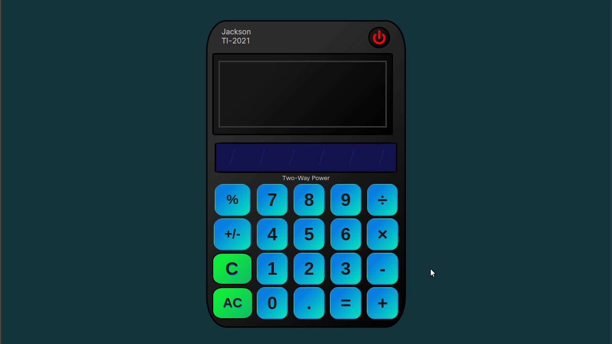
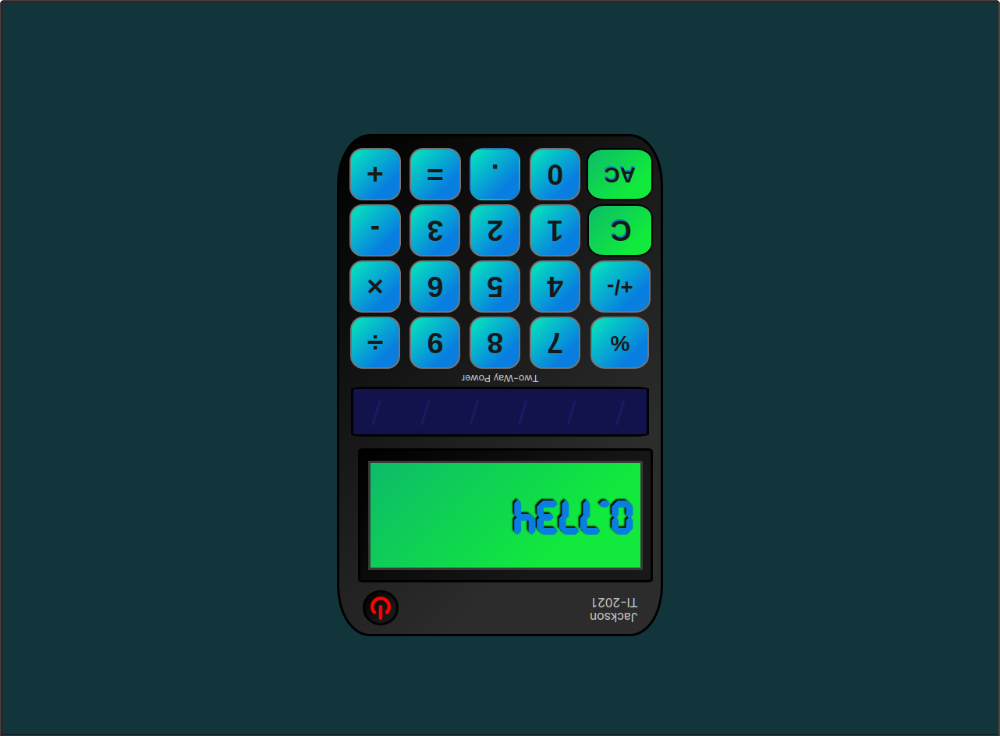

<h1 align="center">
   
  Calculator
   
</h1>

<h4 align="center">An on-screen calculator using JavaScript, HTML, and CSS.</h4>

  <a href="#screenshots">Screenshots</a> •
  <a href="#goals">Goals</a> •
  <a href="#summary">Summary</a> •
  <a href="#author">Author</a> •
    <a href="#credits">Credits</a> •
  <a href="#license">License</a>

### ✨ [Live Demo](https://timjacksonm.github.io/Calculator)

## Screenshots

  
Show Images

  Demonstrates multiple calculations
  
  
  
  Just saying Hello!
  

## Goals:

- [✔️] Your calculator needs to contain functions for all basic math operators you typically find on simple calculators.`+ - * /`
- [✔️] Create a new function `operate` that takes an operator and 2 numbers and then calls one of the above functions on the numbers.
- [✔️] Create a basic HTML calculator with buttons for each digit and each of the above functions.
- [✔️] Add an "equals" & "clear" button.
- [✔️] Create the functions that populate the display when you click the number buttons.
- [✔️] Make the calculator work! Use previous DOM lessons learned and the functions you just created.

**Watch out for and fix these bugs if they show up in your code:**

- [✔️] Make sure user should be able to string together several operations and get right answer. example: `12 + 7 - 5 * 3 = 42`
- [✔️] Answers should round that have long decimals so that they don't overflow the screen.
- [✔️] Pressing "AllClear" should wipe out any existing data.. make sure the user is really starting fresh after pressing "AllClear"
- [✔️] Display an error message if the user tries to divide by 0. Don't let it crash your calculator!

**Extra Credit**

- [✔️] Add a `.` button and let users input decimals!
- [✔️] Make the calculator look nice!
- [✔️] Add a `backspace` button.
- [✔️] Add keyboard support!
- [✔️] make additional buttons work like +/- & %percentage.

**View Commits on project to see changes**

## Summary

This project was very challenging and rewarding. I started with trying to get the functionality figured out in my javascript file. Followed by styling. The most challenging part for me was figuring out the logic for different scenarios that could happen. Specifically the % percentage key. I made its own function just to handle the equations correctly. I also added some personal extra credit goals that were not included in the assighment. This gave me extra learning in areas I wanted to explore. This is a great project that shows where I started before moving on from foundations.

p.s. if you haven't tried to divide by 0 - go ahead and try. Apart from the project being challenging I had fun with it also.

## Author

👤 **Tim Jackson**

- Github: [@timjacksonm](https://github.com/timjacksonm)
- Twitter [@timjacksonm](https://twitter.com/timjacksonm)
- LinkedIn [@timjacksonm](https://linkedin.com/in/timjacksonm)

## Credits

This project idea was a part of my studies at The Odin Project's curriculum. You can see the lesson <a href="https://www.theodinproject.com/paths/foundations/courses/foundations/lessons/calculator" target="_blank">here</a>!

## License

  <a href="https://choosealicense.com/licenses/mit/">
    

